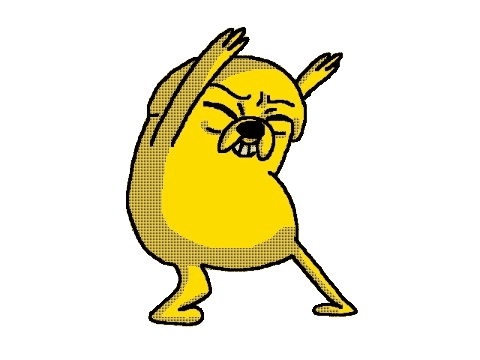

<h1 align="center">Jake the Dog Jam 🎶🎶</h1>

    

#### Make Jake appear next to your progress bar, jamming along with your music synchronized to the beat!

## Before Installing
* ### 1. Install [Spicetify🔥](https://github.com/spicetify) <-- Link to tool and instructions

* ### 2. Once installed, open Spotify and go to marketplace (Shopping cart icon on top left of Spotify)

* ### 3. Look for Cat-Jam Synced by Blafking and install extension

## Instructions for Jake (for Windows)

### 1. Download [Jake gif](jakegif.gif)

### 2. Go to [Ezgif](https://ezgif.com/gif-to-webm) and uploud the gif file

### 3. After uploud, scroll down a bit and from the Output bitrate choose 1M, then press Convert to WebM!

### 4. Once it finishes converting, RIGHT CLICK on the video converted and click Copy video address.

### 5. Go back to Spotify, go to setting and scroll all the way down where you will find the Cat-Jam Settings and paste the link.

### 6. Press Save and Reload and you should have Jake to vibe with 🥳🥳🥳

##

#### DISCLAIMER: I haven't tried it on other systems but I like to think it is the same process other than installing Spicetify.